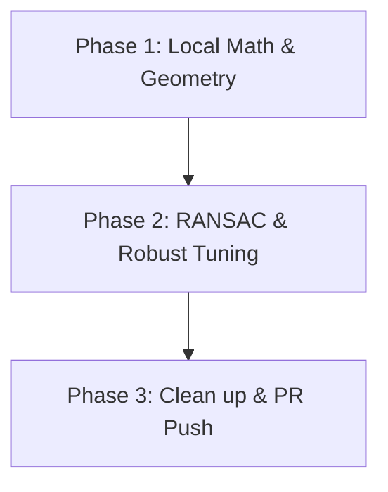

# Task Decision Rules & Complexity Guardrails

To prevent repeating the pattern of getting stuck in long iteration loops (e.g., 30+ commits), this document establishes strict exit criteria, execution phases, and complexity rules for the **Robust Camera Pose Estimation** task.

---

## 1. When to Stop (Circuit Breakers)

If any of the following conditions are met during execution, **we will stop immediately and abandon the task**:

1. **Max PR Commits (5):** We will allow a maximum of **5 commits/pushes** to the remote branch. If the automated pipeline is not green by the 5th push, we stop.
2. **Max Task Review Cycles (3):** We allow a maximum of **3 review revisions** to the task proposal or verification setup. If the task does not pass Harbor's gate after 3 revisions, we stop.
3. **Max Local Verification Runs (8):** If we cannot get the verifier to pass locally within **8 execution iterations**, we stop.
4. **Environment/Platform Wedge:** If we encounter a platform-level issue (e.g., model rate limits, API failures, or docker sandbox hangs) **2 times in a row**, we stop.
5. **No Convergence in 3 Tunings:** If the non-linear optimization (Bundle Adjustment) fails to converge to the accuracy target ($\le 0.005$ rad error) after 3 tuning attempts, we stop.

---

## 2. Iteration Phases & Checks

To maintain control, we will follow 3 strict stages:

### Phase 1: Local Math & Geometry (Commits 1-2)
* Implement radial distortion inversion.
* Implement normalized 8-point algorithm.
* Implement chirality check for translation/rotation decomposition.
* **Stop check:** All local tests on clean data must pass.

### Phase 2: RANSAC & Robust Tuning (Commits 3-4)
* Implement RANSAC with consensus scoring to handle up to 40% outliers.
* Add Scipy-based non-linear optimization for refinement.
* **Stop check:** Local tests with noise and outliers must pass.

### Phase 3: Clean up & PR Push (Commit 5 - Final)
* Verify no extraneous files in `solution/` (results.json, scratch files).
* Ensure `instruction.md` has no implementation hints.
* Final commit and push.

---

## 3. Why the Complexity Makes Sense

Unlike the previous task, the complexity here is **algorithmic and mathematical**, not structural/environmental:
* **No flaky wrappers:** We are passing simple data arrays (`np.ndarray`), which Python handles natively. No closure checking or stack inspection will fail the verifier.
* **Standard framework:** SciPy (`scipy.optimize.least_squares`) and NumPy are pre-installed, robust, and fast.
* **Fast evaluation:** The entire verification process takes $< 2$ seconds, ensuring rapid feedback.
